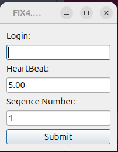
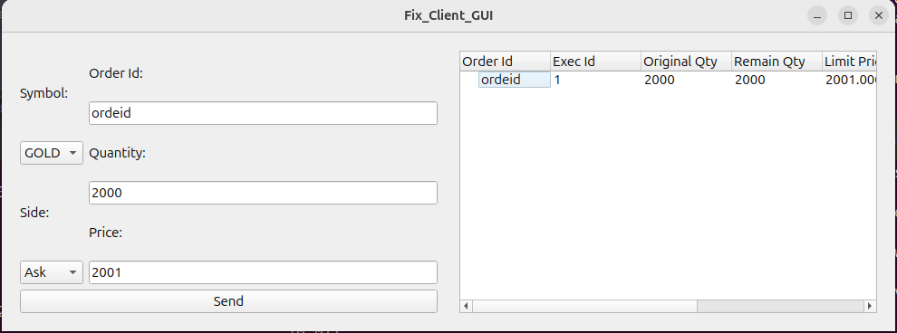

# GUI

The GUI provides a user-friendly interface for interacting with the FIX 4.2 trading client. It allows users to log in, monitor their session, and manage trading activities through intuitive forms and data grids.

## Login screen

  
   
  

  Figure 1: Login screen of the trading client

The login screen allows users to enter their credentials and session parameters:
- **Login:** Enter your login ID.
- **HeartBeat:** Specify the heartbeat interval (in seconds) for FIX session monitoring.
- **Sequence Number:** Set the starting FIX message sequence number.
- **Submit:** Click to initiate the login process and establish a session with the server.

## Trading interface

  
   
  

  Figure 1: Trading interface of the trading client

### Order Placement (Form)

The order placement form allows users to quickly and accurately submit new trading orders to the system.
It is designed for clarity and ease of use, with clearly labeled fields and intuitive controls.

**Form fields:**

- **Symbol:**
  Select the trading symbol (e.g., GOLD) from a dropdown menu.

- **Order Id:**
  Enter a unique identifier for the new order.

- **Quantity:**
  Specify the number of shares or contracts to buy or sell.

- **Side:**
  Choose the order side (e.g., Ask/Sell or Bid/Buy) from a dropdown menu.

- **Price:**
  Enter the limit price for the order.

- **Send:**
  Click the "Send" button to submit the order to the trading system.

Once submitted, the order will appear in the trading history data grid on the right, where its status and execution events can be tracked in real time.

### Trading historic (Data grid)

The **Trading historic** show the historic present the historic of the current trading session, with main row as placed order and sub row as event on the placed order.

#### Columns

1. **Order Id:**
   Unique identifier assigned to each order placed by the user.

2. **Exec Id:**
   Unique identifier for each execution event related to the order (e.g., partial fill, full fill, cancellation).

3. **Original Qty:**
   The total quantity specified when the order was originally placed.

4. **Remain Qty:**
   - **Main row:** Shows the current remaining quantity for the order (i.e., shares not yet executed or canceled).
   - **Sub row:** Displays the remaining quantity immediately after each event (e.g., after a partial fill).

5. **Limit Price:**
   The price limit set for the order. This is the maximum (for buy) or minimum (for sell) price at which the order can be executed.

6. **Avg Price:**
   - **Main row:** The average price across all shares executed so far, including any remaining quantity.
   - **Sub row:** The execution price for the specific event (e.g., the price at which a fill occurred).

7. **Side:**
   Indicates whether the order/event is a buy or sell.

8. **Symbol:**
   The trading symbol (e.g., stock ticker) associated with the order or event.

---

This structure allows users to easily track the lifecycle of each order, monitor execution details, and review trading activity in a clear and organized manner.
