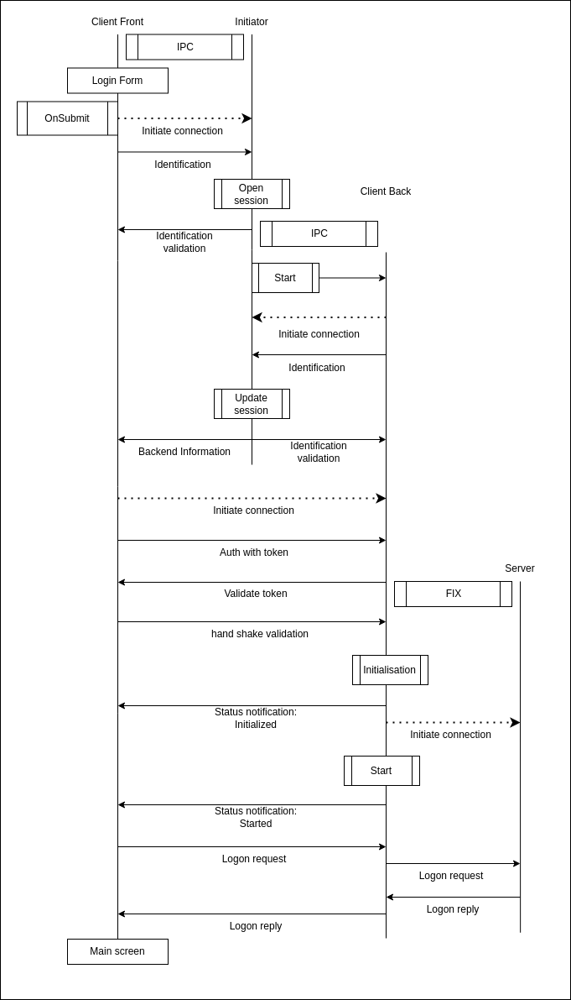

# Initiator

## Authentication protocol

### Sequence diagram

  
   
  

  Figure 1: UML Sequence Diagram of the login flow
   
  available in <a href="../../schema.drawio">schema.drawio</a>

### Step by Step

1. **User Login (Frontend GUI):**
   On the GUI splash screen, when the user submits their credentials (`OnSubmit`), the authentication process begins.

2. **Frontend Connects to Initiator:**
   The **Frontend** establishes a TCP/IP connection to the **Initiator** at a port specified in the configuration.

3. **Frontend Sends Identification:**
   The **Frontend** sends an identification message to the **Initiator**, including the API Key from the configuration.

4. **Initiator Creates Session:**
   Upon receiving the identification message, the **Initiator** creates an in-memory session to manage and synchronize the connection between the **Frontend** and the **Backend**.

5. **Initiator Launches Backend:**
   The **Initiator** starts a subprocess, launching the **Backend** executable to begin its own authentication and synchronization with the **Frontend**.

6. **Backend Authenticates with Initiator:**
   The **Backend** sends an authentication message to the **Initiator**, using the same API Key as the associated **Frontend**.

7. **Session Validation and Token Generation:**
   Once both the **Frontend** and **Backend** are authenticated by the **Initiator**, the session is updated with a unique token to synchronize both components.

8. **Frontend Receives Backend Information:**
   The **Frontend** receives a message (e.g., `Backend Information`) from the **Initiator**, containing the port and token required to connect to the **Backend**.

9. **Frontend Connects to Backend:**
   The **Frontend** establishes a TCP/IP connection to the **Backend** using the provided port, and sends the token and API Key for validation.

10. **Backend Validates Token:**
    The **Backend** checks the received token and API Key. If valid, it responds with the same token to confirm synchronization.

11. **Authentication Complete:**
    At this point, the **Frontend** and **Backend** are securely connected and synchronized, and the user session is fully established.